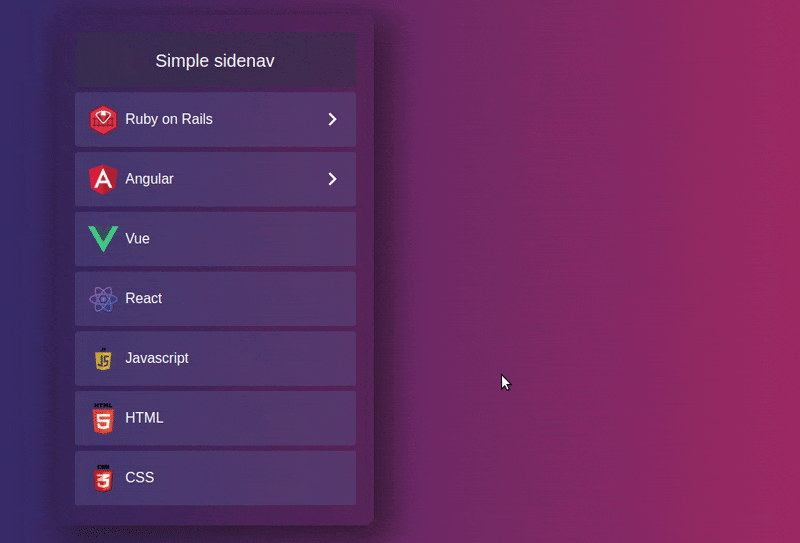

<h1 align="center">Simple sidenav</h1>


**Simple sidenav** is a simple, easily customizable, animated menu, with the possibility of infinite nesting that was built specifically for Angular apps.

## Demos

<p align="center">
 
</p>

## Installation

``` bash
npm install simple-sidenav --save
```

## Usage

**Module**

``` javascript
# app.module.ts
import { BrowserModule } from '@angular/platform-browser';
import { NgModule } from '@angular/core';
import { BrowserAnimationsModule } from '@angular/platform-browser/animations';

import { AppRoutingModule } from './app-routing.module';
import { AppComponent } from './app.component';
import { SimpleSidenavModule } from 'simple-sidenav';

@NgModule({
  declarations: [
    AppComponent
  ],
  imports: [
    BrowserModule,
    AppRoutingModule,
    SimpleSidenavModule,
    BrowserAnimationsModule
  ],
  bootstrap: [AppComponent]
})
export class AppModule { }

```
**Component**

``` javascript
# app.component.ts
import { Component } from '@angular/core';
import { SimpleMenu } from 'simple-sidenav';

@Component({
  selector: 'app-root',
  templateUrl: './app.component.html',
  styleUrls: ['./app.component.scss']
})
export class AppComponent {
  menu: SimpleMenu[] = [...];
  animation: SimpleAnimation = {
    in: { value: 'slide-in-stagger' },
    out: { value: 'slide-out', duration: 200 }
  };

  onClick(item: {id: number|string, name: string, icon: string, index: number}) {
    ...
  }
}

```
**HTML**
``` html
# app.component.html
<sm-simple-sidenav
  [menu]="menu"
  [activeID]="'2'"
  [animation]="animation"
  [withArrow]="true"
  (onSidenav)="onClick($event)">
</sm-simple-sidenav>
```

**[menu] prop example:**
```json
menu: SimpleMenu[] = [
  { "id": "1", "name": "Ruby on Rails", "icon": "assets/images/rails.png", "menu": [
    { "id": "1", "name": "Models", "menu": [
      { "id": "1", "name": "Active Record Basics" },
      { "id": "2", "name": "Active Record Migrations" },
      { "id": "3", "name": "Active Record Validations" },
      { "id": "4", "name": "Active Record Callbacks" },
      { "id": "5", "name": "Active Record Associations" },
      { "id": "6", "name": "Active Record Query Interface", "menu": [...] }
    ] },
    ] },
  { "id": "2", "name": "Angular", "icon": "assets/images/angular.png", "menu": [...] },
  ...
]
```
> NOTE: `id` must be unique, an `icon` is optional, a `menu` can contain an infinite level of nested menu

**[activeID] prop example:**

If you want menu to be opened by default at some position just pass an `id` of menu item to [activeID] prop.
```javascript
[activeID]="'yourMenuItemID'"
```

**[animation] prop example:**

We have two types of animation, **in** and **out**. Value is a name of animation. Duration is an optional parameter that shows how long the animation should work.

For **in:** we have two animations for choice `slide-in | slide-in-stagger`.

For **out:** just one `slide-out`.
```json
{
  "in": { "value": "slide-in-stagger" },
  "out": { "value": "slide-out", "duration": "200" }
}
```
If you don’t want any animations - just pass false into ```[animation]="false"```

## API

| Props           | Default value | Interface                   | Description                                                                          | Required |
| --------------- | ------------- | --------------------------- | ------------------------------------------------------------------------------------ | -------- |
| `[menu]`        | `none`        | ```SimpleMenu[]```          | See example above.                                                                   | `true` |
| `[animation]`   | `false`       | ```SimpleAnimation```       | Pass object with animation name. See example above.                                 | `false`|
| `(onSidenav)`   | `----`        | ```--------```              | Pass callback function to listen for sidenav clicks. `$event` contains an `id` and `index` of the clicked element.|`false`|
| `[animate]`     | `false`       | ```boolean```               | Set to true if you want to animate the first appearance of the sidenav.                  | `false`|
| `[withArrow]`   | `true`        | ```boolean```               | Set to false if you want to hide an arrow icon.                                         | `false`|
| `[activeID]`    | `none`        | ```string```                | Pass an ID of menu item if you want it to be opened by defa.                         | `false`|

## License
Simple sidenav is Copyright © 2015-2018 Codica. It is released under the [MIT License](https://opensource.org/licenses/MIT).

## About Codica

[](https://www.codica.com)

Simple sidenav is maintained and funded by Codica. The names and logos for Codica are trademarks of Codica.

We love open source software! See [our other projects](https://github.com/codica2) or [hire us](https://www.codica.com/) to design, develop, and grow your product.
